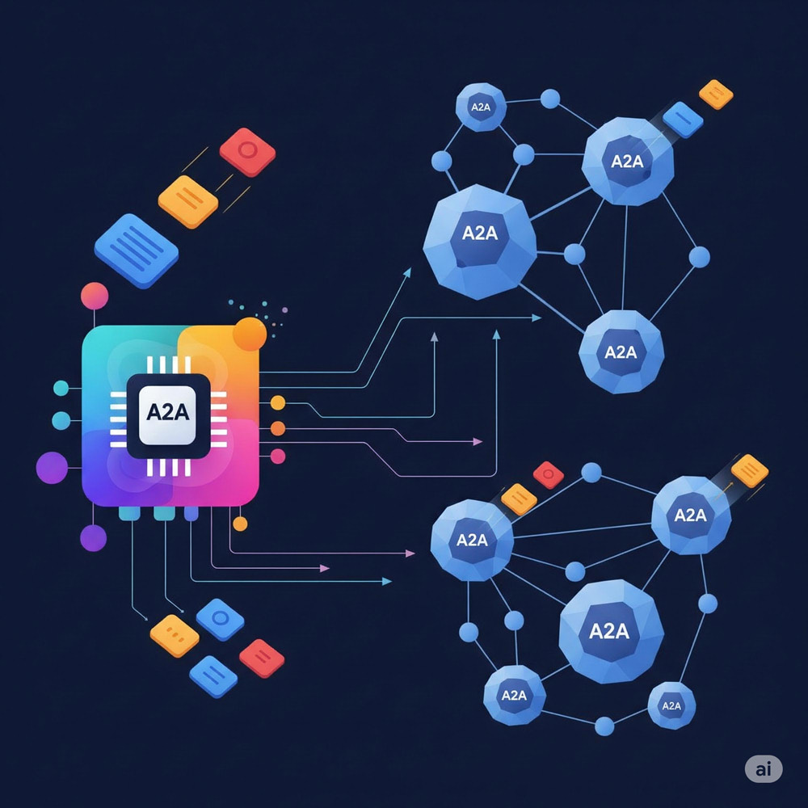

Building Agent2Agent (A2A) Server with Google Apps Script

# A2AApp

<a name="top"></a>
[](LICENCE)

<a name="overview"></a>



# Overview

This is a library for implementing an Agent2Agent (A2A) server using Google Apps Script. This enables AI agent communication and secure service access for AI-powered workflows. This result could potentially highlight the capabilities of Google Apps Script.

# Description

Agent2Agent (A2A) is a proposed open protocol enabling diverse AI agents to communicate and collaborate effectively, breaking down silos and allowing complex task execution while preserving agent opacity (hiding internal workings). This report explores implementing an A2A server using Google Apps Script within Google Workspace. This approach could seamlessly allow AI agents secure access to Google services like Docs and Sheets via a standardized protocol, facilitating AI-powered workflows tied to user data. A sample script demonstrates technical potential despite the lack of a dedicated SDK. While acknowledging Apps Script limitations like execution time and specification, this exploration is valuable for developing internal or user-centric AI integrations within Google Workspace. A successful demonstration could potentially highlight the capabilities of Google Apps Script.

# Usage

## 1. Create a Google Apps Script project

Please create a new Google Apps Script project of the standalone type. [Ref](https://developers.google.com/apps-script/guides/projects#create-standalone) Of course, the sample script in this report can also be used for the container-bound script type.

Open the script editor of the created Google Apps Script project.

## 2. Install a library

### Repository

[https://github.com/tanaikech/A2AApp](https://github.com/tanaikech/A2AApp)

### Library's project key

```
1OuHIiA5Ge0MG_SpKdv1JLz8ZS3ouqhvrF5J6gRRr6xFiFPHxkRsgjMI6
```

In order to simply deploy the A2A server, I created the script as a Google Apps Script library. To use this library, please install the library as follows.

1. Open the script editor of Google Apps Script.
2. [Install this library](https://developers.google.com/apps-script/guides/libraries): The library's project key is **`1OuHIiA5Ge0MG_SpKdv1JLz8ZS3ouqhvrF5J6gRRr6xFiFPHxkRsgjMI6`**.

This library includes [GeminiWithFiles](https://github.com/tanaikech/GeminiWithFiles) for accessing Gemini.

## 3. Web Apps

To allow access from the A2A client, the project uses Web Apps built with Google Apps Script. [Ref](https://developers.google.com/apps-script/guides/web) The A2A client can access the A2A server using a GET and POST HTTP request. Thus, the Web Apps can be used as the A2A server.

Detailed information can be found in [the official documentation](https://developers.google.com/apps-script/guides/web#deploy_a_script_as_a_web_app).

Please follow these steps to deploy the Web App in the script editor.

1. In the script editor, at the top right, click "Deploy" -> "New deployment".
2. Click "Select type" -> "Web App".
3. Enter the information about the Web App in the fields under "Deployment configuration".
4. Select **"Me"** for **"Execute as"**.
5. Select **"Anyone"** for **"Who has access to the app:"**. In this sample, a simple approach allows requests without an access token. However, a custom API key is used for accessing the Web App.
6. Click "Deploy".
7. On the script editor, at the top right, click "Deploy" -> "Test deployments".
8. Copy the Web App URL. It will be similar to `https://script.google.com/macros/s/###/exec`.

**It is important to note that when you modify the Google Apps Script for the Web App, you must modify the deployment as a new version.** This ensures the modified script is reflected in the Web App. Please be careful about this. Also, you can find more details on this in my report "[Redeploying Web Apps without Changing URL of Web Apps for new IDE](https://gist.github.com/tanaikech/ebf92d8f427d02d53989d6c3464a9c43)".

## 4. Script

The script in this sample is as follows.

- Please set your API key for using the Gemini API to `apiKey`.
- Please set your Web Apps URL to `WebAppsURL`.

```javascript
/**
 * Please set your Web Apps URL.
 * This URL is as follows. I think that in order to test the sample, the following URL can be used.
 * https://script.google.com/macros/s/###/exec
 * 
 * If you want to use the access key to Web Apps, please use the following URL.
 * In this case, please include {accessKey: "sample"} to the method "a2aApp".
 * https://script.google.com/macros/s/###/exec?accessKey=sample
 */
const WebAppsURL = "https://script.google.com/macros/s/###/exec";

// doGet and doPost are used for connecting between the A2A server and the A2A client with the HTTP request.
const doGet = e => main(e);
const doPost = e => main(e);

// This is the main function.
function main(eventObject) {
  const apiKey = "###"; // Please set your API key for using Gemini API.

  const object = {
    eventObject,
    agentCard: getAgentCard_,
    functions: getFunctions_,
    apiKey,
  };
  return A2AApp.a2aApp().server(object);
}
```

`getAgentCard_` and `getFunctions_` are the following functions. In this sample, the following agent card and functions are used.

About the agent card, in the current stage, it is required to set `"streaming": false, "pushNotifications": false, "stateTransitionHistory": false` at `capabilities` because of the specification of the Web Apps. Please be careful about this. This also might be a limitation.

```javascript
/**
 * This is a sample agent card.
 * You can see the specification of the agent card at the following official site.
 * Ref: https://google.github.io/A2A/specification/
 * 
 * This agent card of "Currency Exchange Rates Tool" is from
 * https://google.github.io/A2A/specification/#56-sample-agent-card
 * https://github.com/google/A2A/blob/main/samples/python/agents/langgraph/__main__.py#L28
 */
const getAgentCard_ = _ => (
  {
    "name": "Google Resource Manager Agent",
    "description": [
      `Provide management for using Google resources.`,
      `Also, help with exchange values between various currencies.`,
      `1. Return an image data from a given filename by searching Google Drive.`,
      `2. Run with exchange values between various currencies. For example, this answers "What is the exchange rate between USD and GBP?".`,
    ].join("\n"),
    "provider": {
      "organization": "Tanaike",
      "url": "https://github.com/tanaikech"
    },
    "version": "1.0.0",
    "url": WebAppsURL,
    "defaultInputModes": ["text/plain"],
    "defaultOutputModes": ["text/plain"],
    "capabilities": {
      "streaming": false,
      "pushNotifications": false,
      "stateTransitionHistory": false,
    },
    "skills": [
      {
        "id": "get_image_from_google_drive",
        "name": "Get Images from Google Drive",
        "description": "Return an image data from a given filename by searching Google Drive.",
        "tags": ['image', 'google drive'],
        "examples": [
          'Return an image file of "sample.png" on Google Drive.',
          'Show an image file of "sample.png" on Google Drive.'
        ],
        "inputModes": ["text/plain"],
        "outputModes": ["image/png"]
      },
      {
        "id": "convert_currency",
        "name": "Currency Exchange Rates Tool",
        "description": "Helps with exchange values between various currencies",
        "tags": ['currency conversion', 'currency exchange'],
        "examples": ['What is exchange rate between USD and GBP?'],
        "inputModes": ["text/plain"],
        "outputModes": ["text/plain"]
      }
    ]
  }
);

/**
 * This is an object including sample functions. These functions are used for creating the response data to the A2A client.
 * You can see the specification of this object as follows.
 * Ref: https://github.com/tanaikech/GeminiWithFiles?tab=readme-ov-file#use-function-calling
 * 
 * get_exchange_rate is from the Google's sample as follows.
 * Ref: https://github.com/google/A2A/blob/main/samples/python/agents/langgraph/agent.py#L19
 */
const getFunctions_ = _ => (
  {
    params_: {
      get_image_from_google_drive: {
        description: "Use this to get image data from Google Drive by giving a filename.",
        parameters: {
          type: "object",
          properties: {
            filename: {
              type: "string",
              description: "Filename of the image file on Google Drive."
            }
          },
          required: ["filename"]
        }
      },
      get_exchange_rate: {
        description: "Use this to get current exchange rate.",
        parameters: {
          type: "object",
          properties: {
            currency_from: {
              type: "string",
              description: "Source currency. Default is USD."
            },
            currency_to: {
              type: "string",
              description: "Destination currency. Default is EUR."
            },
            currency_date: {
              type: "string",
              description: "Date of the currency. Default is latest."
            }
          },
          required: ["currency_from", "currency_to", "currency_date"]
        }
      },
    },

    get_image_from_google_drive: ({ filename }) => {
      let result;
      try {
        const files = DriveApp.searchFiles(`title contains '${filename}' and mimeType contains 'image' and trashed=false`);
        if (files.hasNext()) {
          const file = files.next();

          /**
           * You can see the format of the response value from the following official document.
           * Ref: https://google.github.io/A2A/specification/#65-part-union-type
           */
          result = {
            type: "file",
            file: {
              name: file.getName(),
              bytes: Utilities.base64Encode(file.getBlob().getBytes()),
              mimeType: file.getMimeType(),
            },
            metadata: null
          };

        } else {
          result = `There is no file of "${filename}".`;
        }
      } catch (err) {
        result = err.message;
      }
      return {
        returnThis: true, // When this is true, the response value to the A2A client is this result of this function. When you want to directly return the data from the function, please use this.
        result,
      }
    },

    /**
     * Ref: https://github.com/google/A2A/blob/main/samples/python/agents/langgraph/agent.py#L19
     * When returnThis is not used, the response value to the A2A client is generated using this result of this function.
     */
    get_exchange_rate: ({ currency_from, currency_to, currency_date }) => ({
      returnThis: false, // When this is false, the response value to the A2A client is generated using this result of this function.

      /**
       * You can see the format of the response value from the following official document.
       * Ref: https://google.github.io/A2A/specification/#65-part-union-type
       */
      result: {
        type: "text",
        text: JSON.parse(UrlFetchApp.fetch(`https://api.frankfurter.app/${currency_date}?from=${currency_from}&to=${currency_to}`).getContentText()),
        metadata: null
      }

    }),

  }
);
```

Here, `get_image_from_google_drive` and `get_exchange_rate` are the functions of Google Apps Script. These scripts are automatically run in this script. And, the response value is generated using the result from the function, and the value is returned to the A2A client.

### Options
A2AApp has the following options.

- In the case of `Execute as: Me` and `Who has access to the app: Anyone` for Web Apps, anyone can access. To enhance security, an access key can be used. When using the access key, please set it as follows: `return new A2AApp.a2aApp({accessKey: "sample"}).server(object);`. Additionally, please add it as a query parameter to the Web App URL as follows: `https://script.google.com/macros/s/###/exec?accessKey=sample` and `https://script.google.com/macros/s/###/dev?access_token=###&accessKey=sample`.
- A2AApp can also record a log. In this case, please set it as follows: `return new A2AApp.a2aApp({accessKey: "sample", log: true, spreadsheetId: "###"}).server(object);`. With this setting, the log is recorded in the Spreadsheet.

### Format of returned value from function

In this script, please set the format of the value returned from the function as follows.

```json
{
  "returnThis": [Boolean],
  "result": { [Part] }
}
```

  - `returnThis`: There is a case where it is required to return the raw data from the function. In this case, please use this. When you want to directly return the data from the function, please set `true`. When this is `false`, the final response text is generated using the result of the function.
  - `result`: Result from the function. The details of `[Part]` can be seen at [the official document](https://google.github.io/A2A/specification/#65-part-union-type).

### Another approach

Of course, you can use this library by directly copying and pasting "A2AApp" into your script editor without using it as a library. In that case, please copy and paste the script of this library. And modify as follows.

```javascript
return new A2AApp.a2aApp().server(object);
```

to

```javascript
return new A2AApp().server(object);
```

## 5. Prepare a demo for testing an A2A Protocol

The demo can be retrieved from [https://github.com/google/A2A](https://github.com/google/A2A).

To connect the client of this demo to the Web App created using Google Apps Script, several modifications are required as follows.

### 5-1. Add redirect

Accessing the Web App requires a redirect. However, currently, the demo script cannot handle redirects. Therefore, a modification is required. Please modify the `_send_request` function in `A2A/samples/python/common/client/client.py` as follows. [Ref](https://github.com/google/A2A/blob/main/samples/python/common/client/client.py#L66) This modification allows the client to access the Web App.

From

```python
response = await client.post(
    self.url, json=request.model_dump(), timeout=self.timeout
)
```

To

```python
response = await client.post(
    self.url, json=request.model_dump(), timeout=self.timeout, follow_redirects=True
)
```

### 5-2. Add query parameter

As mentioned in the next section, to directly access the Web App using the `.well-known/agent.json` path, an access token is required. In this case, the access token must be included as a query parameter. However, currently, the demo script cannot add the query parameter. Therefore, a modification is required. Please modify the `get_agent_card` function in `A2A/demo/ui/utils/agent_card.py` as follows. [Ref](https://github.com/google/A2A/blob/main/demo/ui/utils/agent_card.py) This modification ensures that when a URL like `https://script.google.com/macros/s/###/dev?access_token=###` is used to register the agent card, it is correctly converted to `https://script.google.com/macros/s/###/dev/.well-known/agent.json?access_token=###`. This allows the Web App to be accessed using the `.well-known/agent.json` path.

```python
import requests

from common.types import AgentCard
from urllib.parse import urlparse

def get_agent_card(remote_agent_address: str) -> AgentCard:
    """Get the agent card."""
    p = urlparse(remote_agent_address)
    url = f"{p.scheme}://{p.netloc}{p.path}/.well-known/agent.json?{p.query}"

    # agent_card = requests.get(f'http://{remote_agent_address}/.well-known/agent.json')
    agent_card = requests.get(url)

    return AgentCard(**agent_card.json())
```

This modification is not required if you are using a local server to register the Web App's agent card.

## 6. Register Agent Card

To register the agent card on the client side, there are the following two patterns.

### Pattern 1

In this pattern, the agent card is registered directly from the A2A server to the A2A client. To achieve this, it is required to know the specifications of Web Apps in Google Apps Script. When the agent card is registered to the client side, it is required to access the path `https://{someURL}/.well-known/agent.json`. Unfortunately, at the current stage, Web Apps cannot be directly accessed with such a URL. However, when an access token is used, Web Apps can be accessed using such a URL. [Ref](https://github.com/tanaikech/taking-advantage-of-Web-Apps-with-google-apps-script?tab=readme-ov-file#pathinfo-updated-on-february-14-2023) The path `.well-known/agent.json` can be confirmed as `pathInfo` in the event object of Web Apps. This specification is used in this pattern.

To test this, the URL for registering the agent card is retrieved using the following script.

```javascript
/**
 * This function is used for retrieving the URL for registering the AgentCard.
 * Please directly run this function and copy the URL from the log.
 */
function getRegisteringAgentCardURL() {
  const registeringAgentCardURL = `${ScriptApp.getService().getUrl()}?access_token=${ScriptApp.getOAuthToken()}`;
  console.log(registeringAgentCardURL);


  // The following comment line is used for automatically detecting the scope of "https://www.googleapis.com/auth/drive.readonly". This scope is used for accessing Web Apps. So, please don't remove the comment.
  // DriveApp.getFiles();
}
```

At the current stage, the expiration time of the access token is 1 hour. However, it is considered that this will be sufficient for testing this sample. If you want to permanently use the server built with Web Apps created by Google Apps Script, the next pattern 2 might be useful.

### Pattern 2

In this pattern, the agent card is registered to the A2A client using a local server. The sample script is as follows.

Please set your Web Apps URL to `WebApps_URL = "https://script.google.com/macros/s/###/exec"`. If you want to use an access key, please add it like `https://script.google.com/macros/s/###/exec?accessKey=sample`.

**IMPORTANT: In this case, `/dev` is not used. It's required to be `/exec` because the access token is not used.. Please be careful about this.**

When you add the agent card for the A2A server with Web Apps, it can be achieved by putting the Web Apps URL into `url` in the agent card. In this case, the access token is not required because Web Apps is not accessed via the `.well-known/agent.json` path. You can register the agent card using this server. In this pattern, the A2A server created by Web Apps can be used permanently.

```python
import logging
import click

from common.server import A2AServer
from common.types import (
    AgentCapabilities,
    AgentCard,
    AgentSkill,
)


WebApps_URL = "https://script.google.com/macros/s/###/exec"

logging.basicConfig(level=logging.INFO)
logger = logging.getLogger(__name__)


@click.command()
@click.option('--host', 'host', default='localhost')
@click.option('--port', 'port', default=10001)
def main(host, port):
    """Starts the Sample Agent server."""

    capabilities = AgentCapabilities(streaming=False, pushNotifications=False)
    skill = AgentSkill(
        id="###",
        name="###",
        description="###",
        tags=["###"],
        examples=["###"],
    )
    agent_card = AgentCard(
        name="###",
        description="###",
        url=WebApps_URL,
        version='1.0.0',
        defaultInputModes=['text', 'text/plain'],
        defaultOutputModes=['text', 'text/plain'],
        capabilities=capabilities,
        skills=[skill],
    )

    server = A2AServer(
        agent_card=agent_card,
        task_manager={},
        host=host,
        port=port,
    )

    logger.info(f'Starting server on {host}:{port}')
    server.start()


if __name__ == '__main__':
    main()
```

## 7. Testing

To test this, complete the following steps:

- The A2A server for the Web Apps has already been deployed.
- The demo script at [https://github.com/google/A2A](https://github.com/google/A2A) has already been modified to access the Google Apps Script web app.
- The demo script has already been run.

Once the above steps are completed, access `http://0.0.0.0:12000/` or `http://localhost:12000` in your browser. This will display the UI like the following demonstration.


In your browser, perform the following steps:

1.  Set your API key for the Gemini API.
2.  Set the agent by inputting the URL `https://script.google.com/macros/s/###/dev?access_token=###`. This can be obtained from the `getRegisteringAgentCardURL` function in Google Apps Script.
3.  Input questions like `Exchange 10,000 yen to US Dollars with current rate.` and `Show the image of CherryBlossom from Google Drive.`. Replace `CherryBlossom` with your filename.

By following these steps, you can see results similar to the demonstration shown above.

# Note

- In the current version of [https://github.com/google/A2A](https://github.com/google/A2A), it seems that the JPEG image cannot be displayed in the browser. This might be resolved in the future update.

---

<a name="licence"></a>

# Licence

[MIT](LICENCE)

<a name="author"></a>

# Author

[Tanaike](https://tanaikech.github.io/about/)

[Donate](https://tanaikech.github.io/donate/)

<a name="updatehistory"></a>

# Update History

- v1.0.0 (May 16, 2025)

  1. Initial release.

[TOP](#top)


